# VibeSync Mobile App

A dynamic social media app platform built with Expo React Native, featuring video sharing, community interactions, and real-time messaging.

## 📲 Download & Installation

### Quick Start - Download APK

Get started immediately with the latest version of VibeSync:

[](https://drive.google.com/file/d/1kOwKE5Q2gOyZ_5MwoazNu2cVt8UzO8aA/view?usp=sharing)

- Latest Version: v1.0.0
- Release Date: November 10, 2024
- Size: 93.2MB
- Android Requirements: Android 6.0 and above

### Installation Instructions

1. Download the APK from the link above
2. Enable "Install from Unknown Sources" in your Android settings
3. Open the downloaded APK file
4. Follow the installation prompts
5. Launch VibeSync and enjoy!

### Features Available in APK:

- ✅ Full Video Feed Experience
- ✅ Community Interactions
- ✅ Real-time Chat
- ✅ Gigs Marketplace
- ✅ User Profiles
- ✅ Content Creation

### Having Issues?

If you encounter any installation problems:

- Email: otuyaalvin@gmail.com
- X(Formerly Twitter): [@alvinotuya](https://x.com/alvinotuya)


## 📱 App Screenshots

### Feed Tab

Scroll through engaging video content in a TikTok-style interface.

<div style="display: flex; gap: 10px;">
  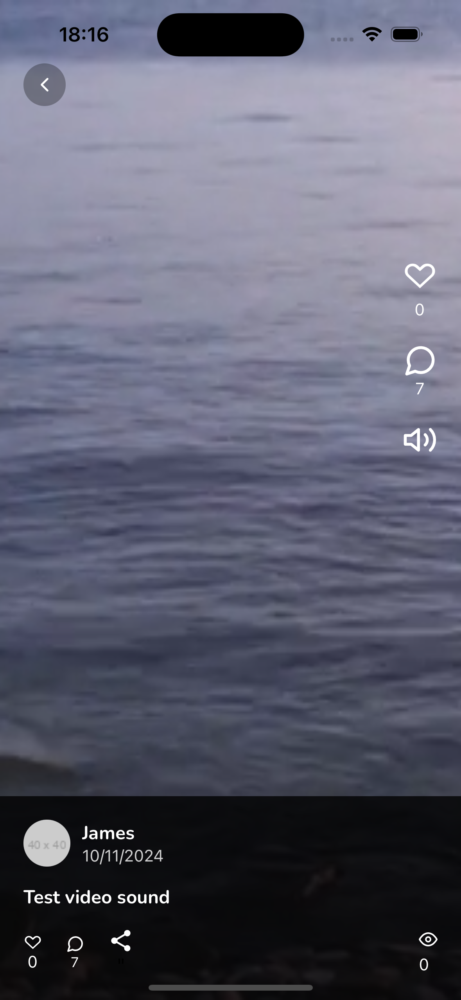
  
</div>

### Explore Tab

Discover new content and creators through our powerful search.

<div style="display: flex; gap: 10px;">
  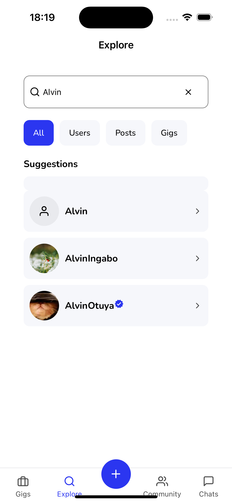
  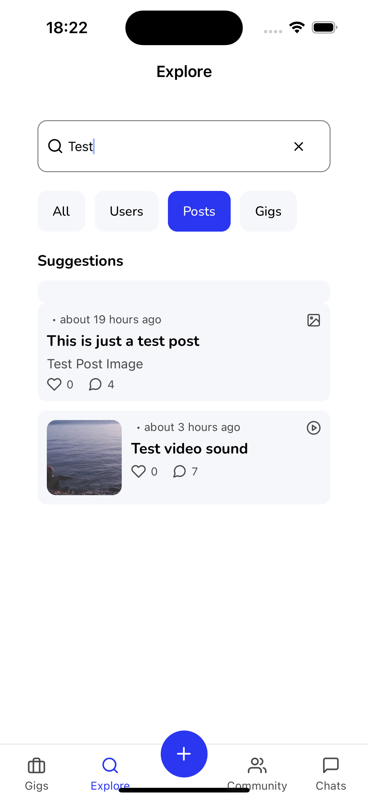
</div>

### Community Tab

Connect with creators and engage with their content.

<div style="display: flex; gap: 10px;">
  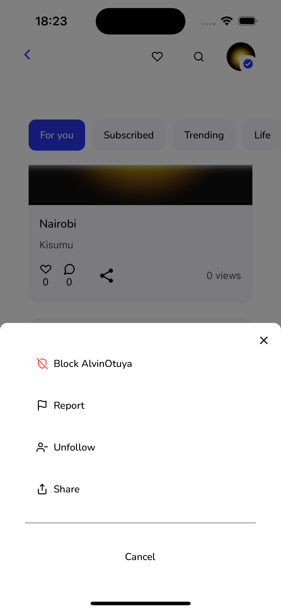
  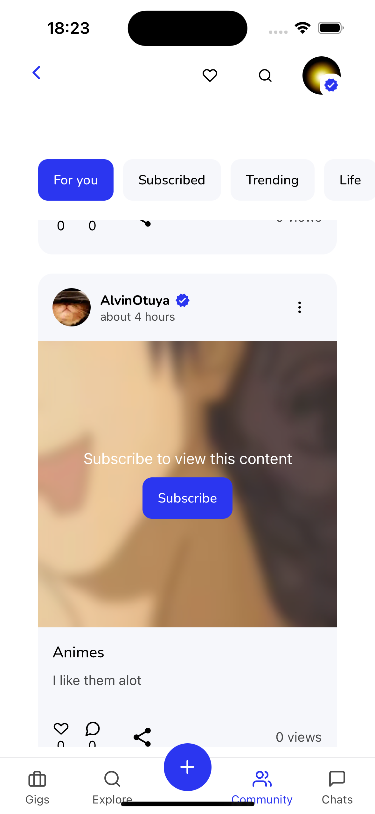
</div>

### Gigs Tab

Browse and post freelance opportunities.

<div style="display: flex; gap: 10px;">
  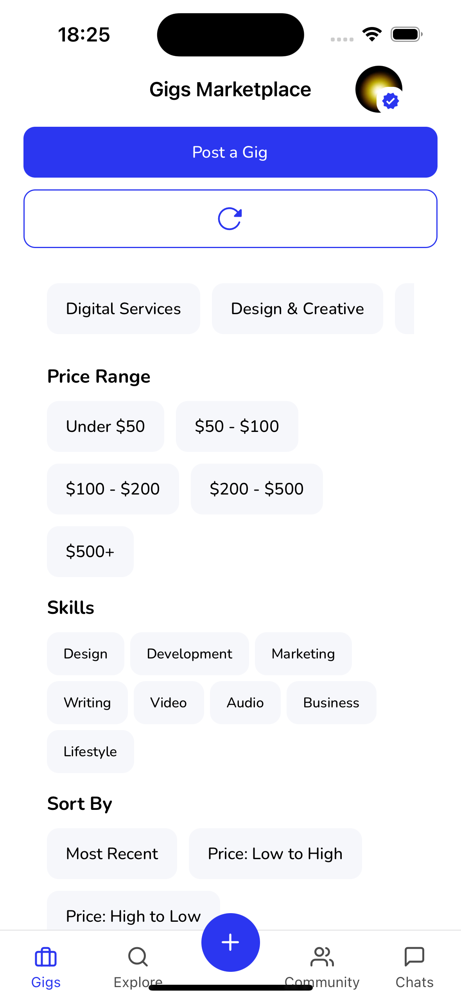
  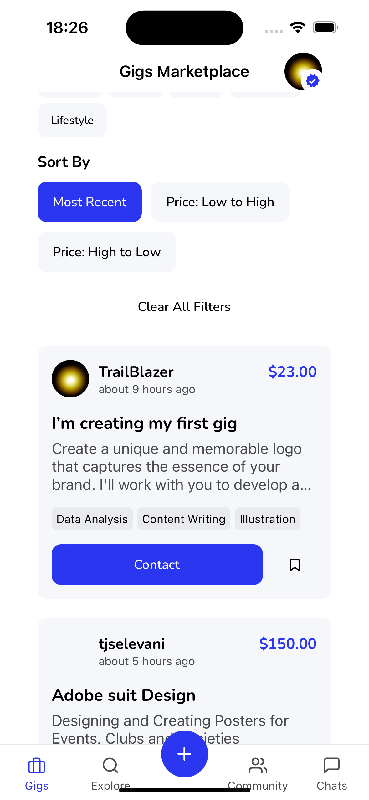
</div>

### Chat Tab

Real-time messaging with other users.

<div style="display: flex; gap: 10px;">
  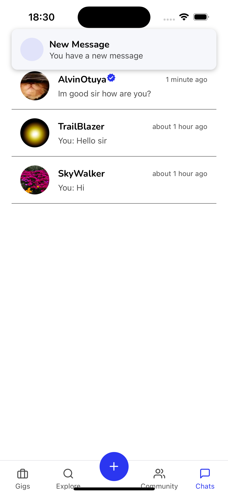
  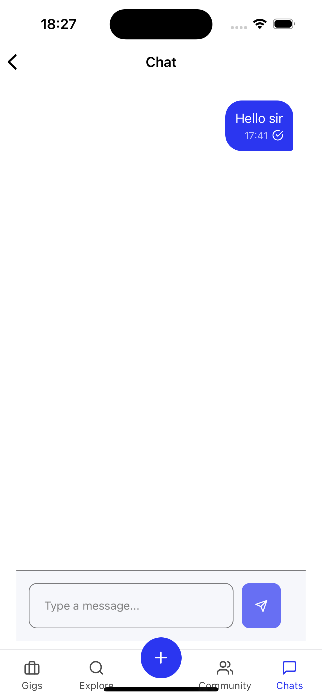
</div>

Extra Features for App Enhancement

<div style="display: flex; gap: 10px;">
  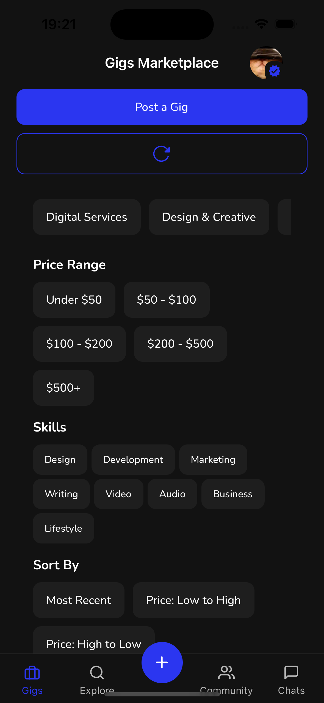
  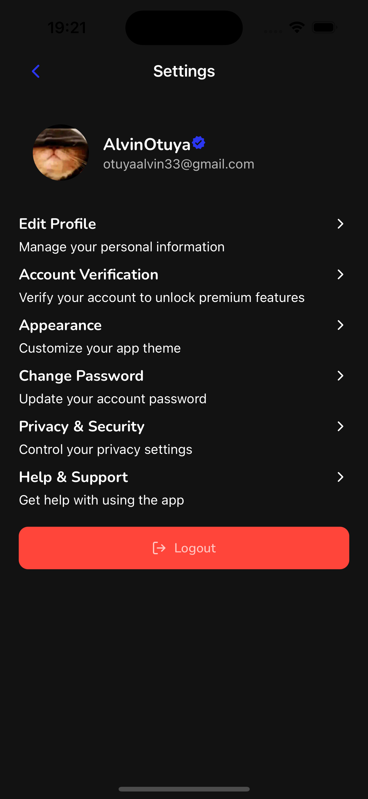
  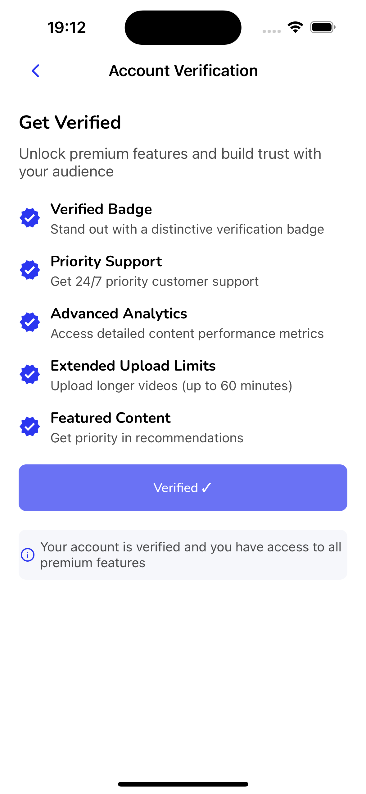
  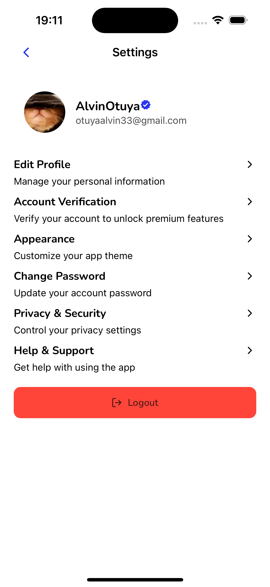
  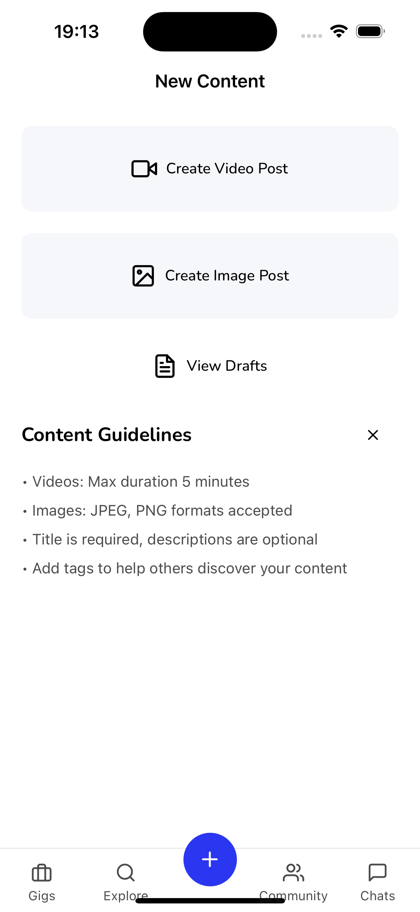
  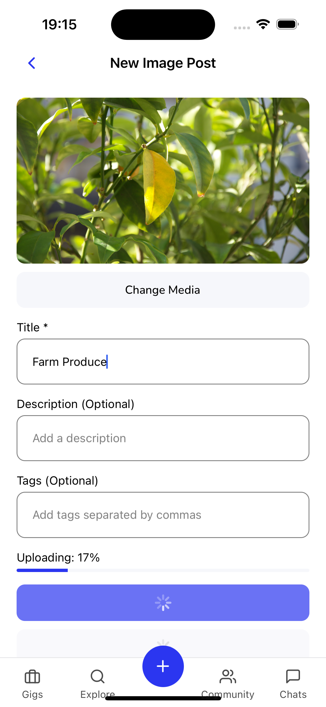
  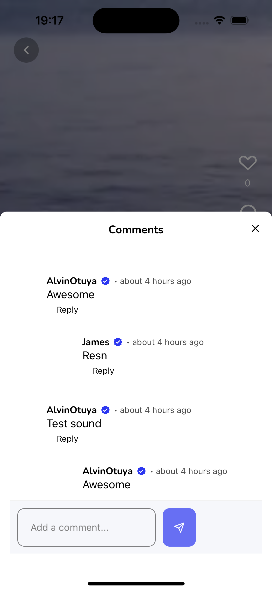
  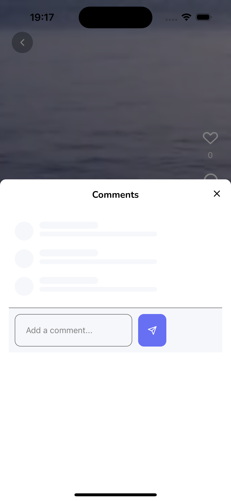
  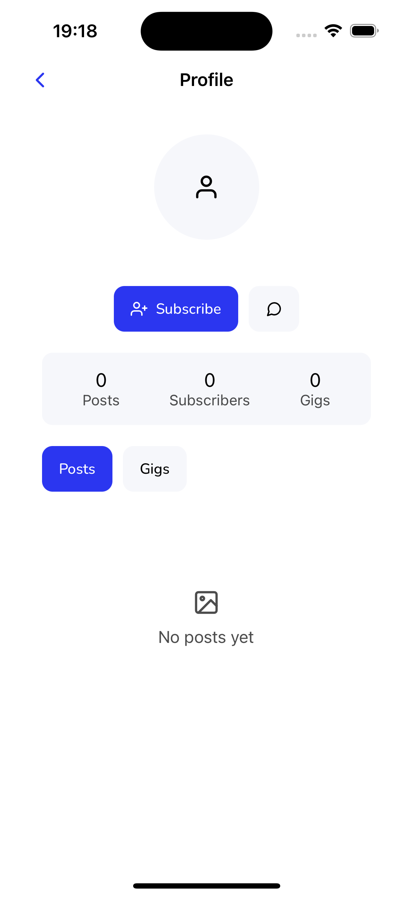
  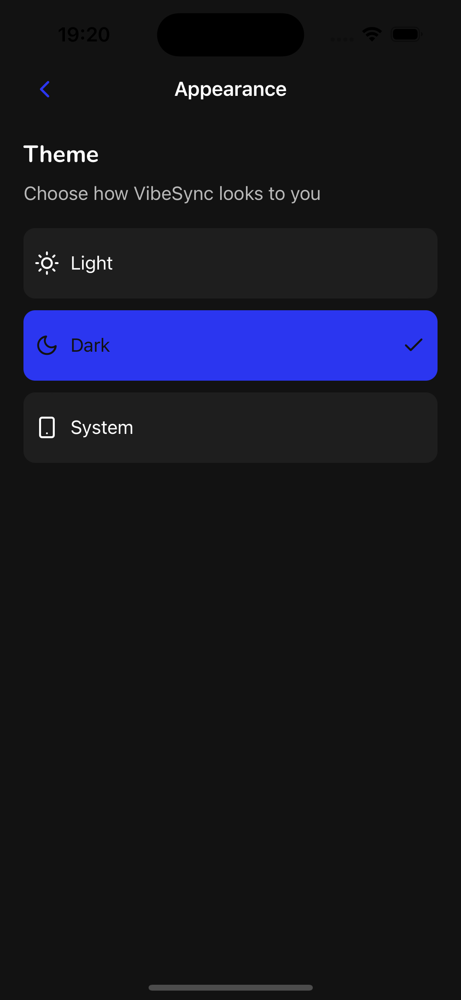

</div>

## ✨ Features

### Core Features

- 📹 Video Feed
  - TikTok-style vertical scrolling
  - Auto-playing videos
  - Like, comment, and share functionality
  - Video preview thumbnails

### Authentication & User Management

- 🔐 Secure authentication system
- 👤 Profile management
- ✓ Account verification system
- ⚙️ Settings management

### Community Features

- 🤝 User following/subscription system
- 📝 Content creation and sharing
- 💬 Comments and interactions
- 🔔 Real-time notifications
- 📨 Direct messaging

### Premium Features

- ✅ Verified user badges
- 🔒 Premium content access
- ⬆️ Extended upload limits

### Developer Version

For developers who want to build from source, see [Development Setup](#-getting-started) below.

## 🛠 Technology Stack

- **Framework**: Expo React Native
- **State Management**:
  - Zustand for global state
  - React Query for server state
- **Navigation**: Expo Router
- **UI Components**: Custom themed components
- **API Integration**: Custom fetch utilities
- **Real-time Features**: Socket.IO
- **Storage**: Expo SecureStore

## 📱 App Structure

```

src/
├── app/ # Expo Router app directory
│ ├── (auth)/ # Authentication routes
│ ├── (tabs)/ # Main app tabs
│ └── [dynamic]/ # Dynamic routes
├── components/ # Reusable components
├── constants/ # App constants and configs
├── hooks/ # Custom hooks
├── stores/ # Zustand stores
├── types/ # TypeScript definitions
└── utils/ # Utility functions

```

## 🚀 Getting Started

### Prerequisites

- Node.js 16+
- npm or yarn
- Expo CLI
- iOS Simulator/Android Emulator

### Installation

```bash
# Install dependencies
npm install

# Start the development server
npx expo start

# Run on iOS
npm run ios

# Run on Android
npm run android
```

### Environment Setup

Create a `.env` file in the root directory:

```env
EXPO_PUBLIC_BASE_URL=your_api_url
EXPO_PUBLIC_STRIPE_PUBLISHABLE_KEY=your_stripe_key
```

## 📱 Main Features Walkthrough

### Video Feed

- Vertical scrolling interface
- Auto-playing videos
- Double-tap to like
- Share functionality
- Comment system

### Explore

- Search for users, posts, and gigs
- Filter by content type
- Recent searches history
- Trending content

### Community

- Post creation
- User interactions
- Content moderation
- Reporting system

### Gigs

- Marketplace interface
- Gig creation
- Filtering system
- Contact integration

### Chat

- Real-time messaging
- Message notifications


## 🔒 Security Features

- JWT Authentication
- Secure token storage
- API request encryption
- Input validation and sanitization

## 💻 Development

### Code Style

We follow strict coding standards:

```bash
# Run linting
npm run lint

# Run type checking
npm run typecheck
```

### Testing

```bash
# Run tests
npm test

# Run with coverage
npm run test:coverage
```

### Building for Production

```bash
# Build for iOS
eas build --platform ios

# Build for Android
eas build --platform android
```

## 🤝 Contributing

1. Fork the Project
2. Create your Feature Branch (`git checkout -b feature/AmazingFeature`)
3. Commit your Changes (`git commit -m 'Add some AmazingFeature'`)
4. Push to the Branch (`git push origin feature/AmazingFeature`)
5. Open a Pull Request

## 📄 License

This project is licensed under the MIT License - see the LICENSE file for details

## 📞 Support

For support, please contact:

- Email: otuyaalvin@gmail.com
- X(Formerly Twitter): [@alvinotuya](https://x.com/alvinotuya)
- LinkedIn: [Alvin Otuya](https://www.linkedin.com/in/alvin-otuya-3744b7257/)

## 🙌 Author & Maintainer

Developed and maintained by [Alvin Otuya](https://www.linkedin.com/in/alvin-otuya-3744b7257/)

## 🙏 Acknowledgments

- [Alvin Otuya](https://www.linkedin.com/in/alvin-otuya-3744b7257/) - Creator & Main Developer
- [Expo](https://expo.dev/)
- [React Native](https://reactnative.dev/)
- [TypeScript](https://www.typescriptlang.org/)
- All our contributors and users!
